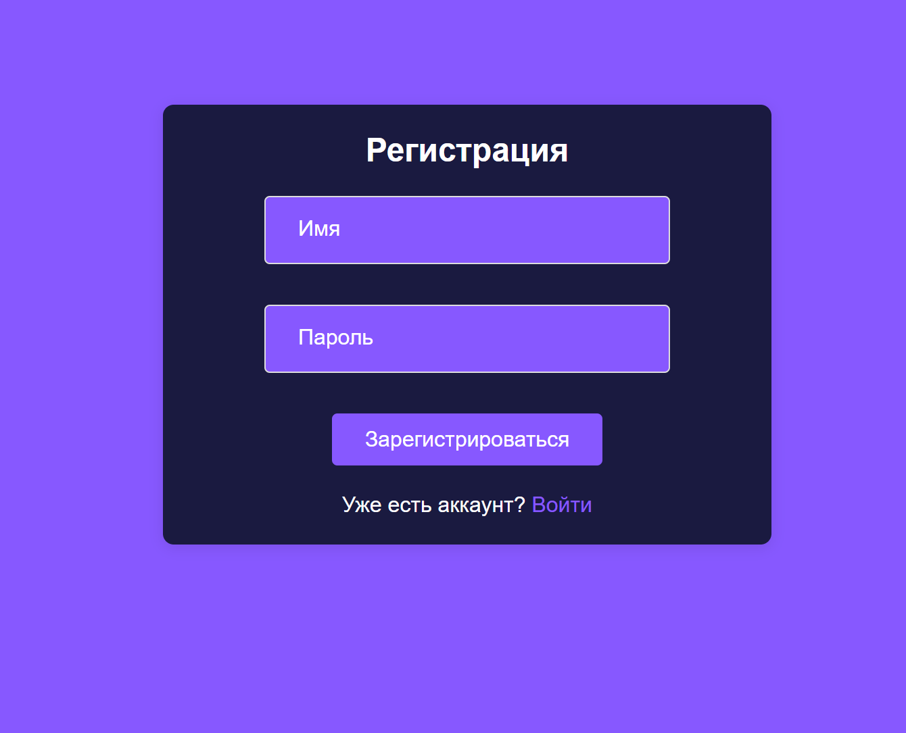
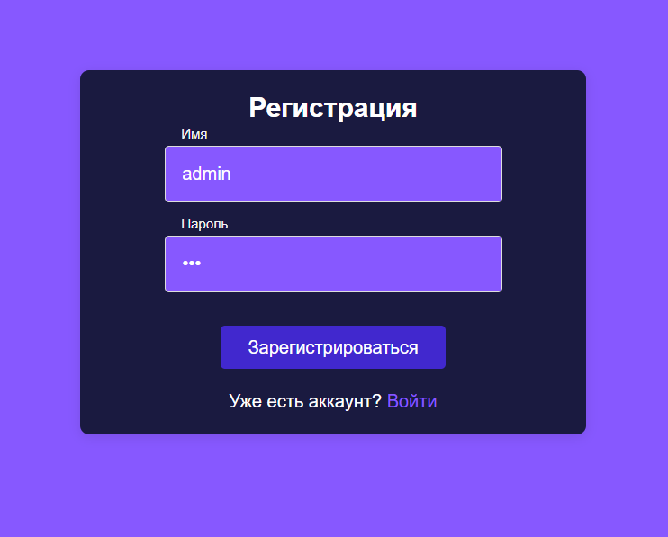
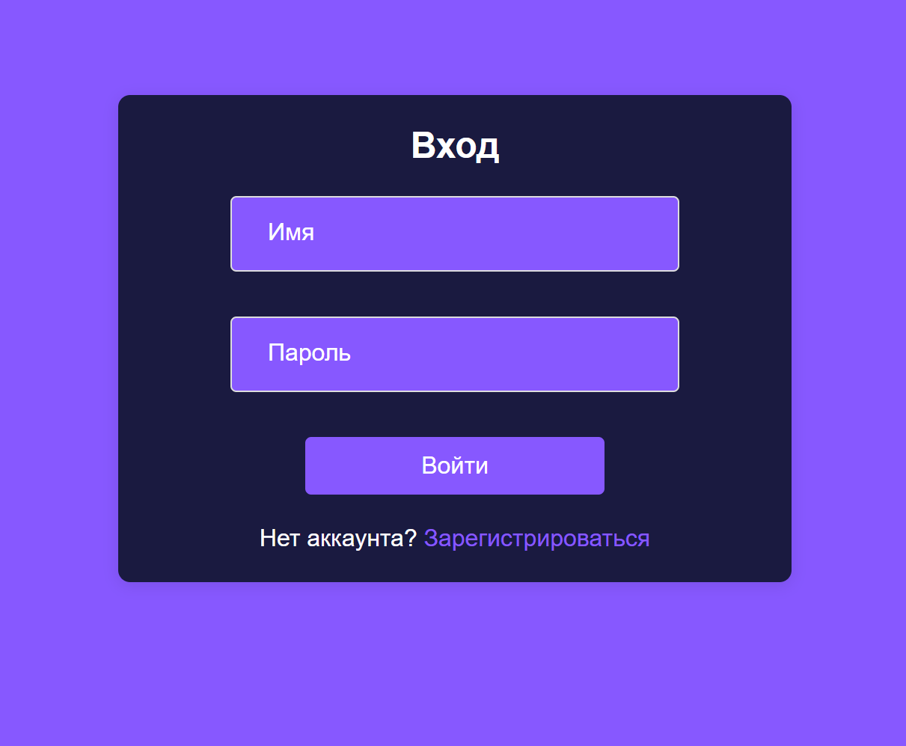
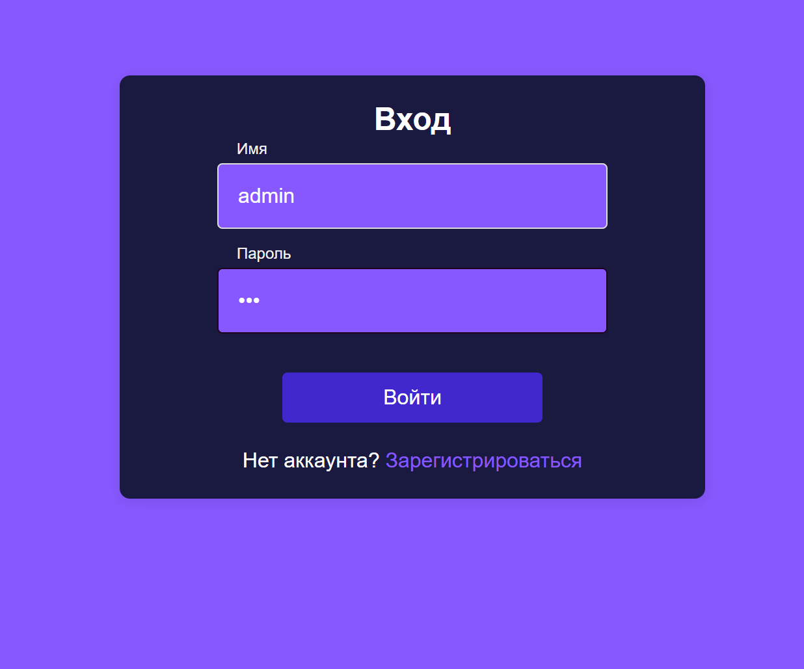
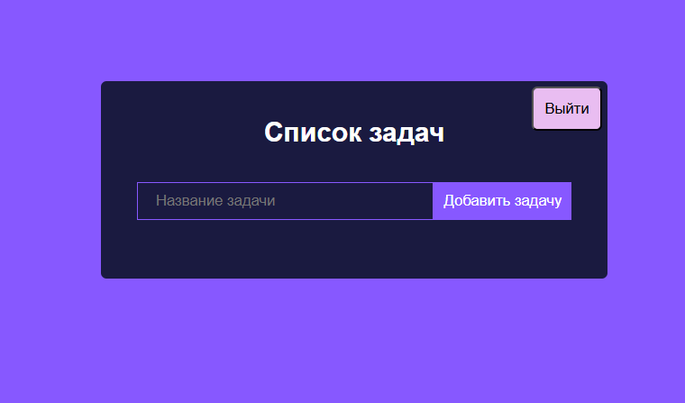
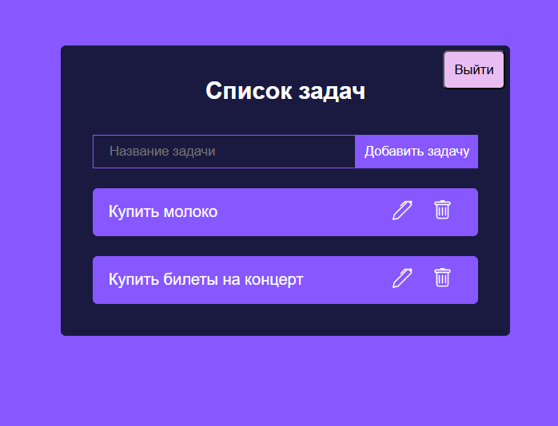

# Todo-list-App

Проект представляет собой веб-приложение с авторизацией для управления списком задач с возможностью их редактирования, отметки выполненных и удаления задач.

## Технологии

### Frontend:

- React.js
- React Router
- React Context
- React memo

### Стилизация:

- CSS

### Дополнительная информация:

- Данные о пользователях и их задачах остаются в Local Storage, поскольку реализована Frontend - часть приложения, но его можно легко интегрировать с Backend.

## Скриншоты

### Страница регистрации

### Страница авторизации

### Главная страница

 
